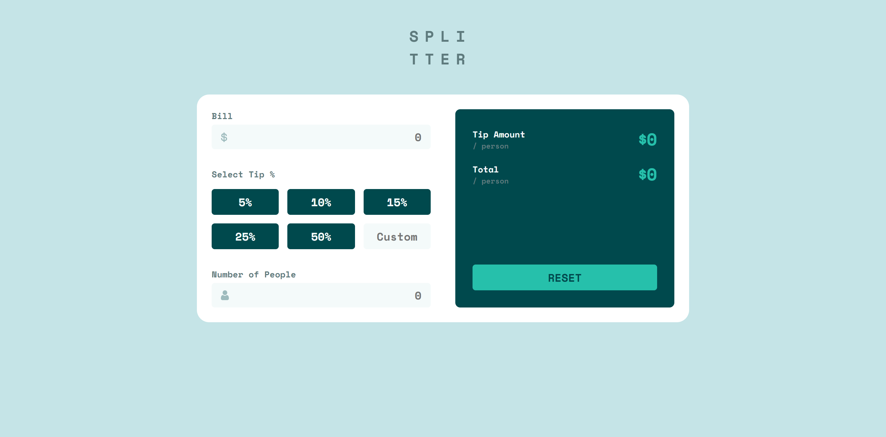

# Frontend Mentor - Tip calculator app solution

This is a solution to the [Tip calculator app challenge on Frontend Mentor](https://www.frontendmentor.io/challenges/tip-calculator-app-ugJNGbJUX). Frontend Mentor challenges help you improve your coding skills by building realistic projects.

## Overview

### The challenge

Users should be able to:

- View the optimal layout for the app depending on their device's screen size
- See hover states for all interactive elements on the page
- Calculate the correct tip and total cost of the bill per person

### Screenshot 📷

#### 💻 desktop(1440px)

### Links 🔗

- Live Site URL: 

## My process 🚀

### Built with

- HTML
- CSS
- Mobile-first workflow
- React

## Social media 📱

- Linkedin - [@AmirhoseinHashemi](https://linkedin.com/in/amirhoseinhashemi)
- X (Twitter) - [@\_AmirHashemi](https://twitter.com/_AmirHashemi)
- Frontend Mentor - [@AmirhosseinHashemi](https://www.frontendmentor.io/profile/AmirhosseinHashemi)
